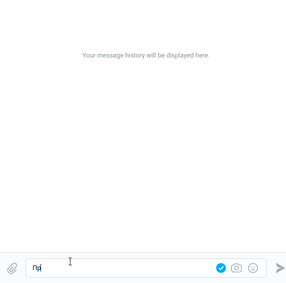

## Боты для Вк и Телеграм

Представленные боты для Телеграм и Вконтакте общаются с пользователем при помощи Dialogflow.  
## Запуск

Скачайте код с [Github](https://github.com/Shirlusha/dvmn-support-bot)

Установите зависимости командой

```
 pip install -r requirements.txt
 ```

В корне папки создайте файл ```.env```, в который впишите

```BOT_TOKEN``` - токен вашего бота в Телеграм от [BotFather](https://telegram.me/BotFather)

```SESSION_ID``` - ID для чата с ботом в Телеграм [userinfobot](https://telegram.me/userinfobot)

```PROJECT_ID``` - Project ID, указанный в свойствах к агенту в Dialogflow

```JSON_PATH``` - путь к файлу json c вопросами для бота, по умолчанию ```questions.json```

```GOOGLE_APPLICATION_CREDENTIALS``` - путь к файлу json с секретным ключом, пример создания
по [ссылке](https://cloud.google.com/docs/authentication/getting-started)

```VK_ACESS_TOKEN``` - API ключ от вашей группы Вконтакте, лежащий в разделе "Работа с API"

Запустите бота командой

**Вконтакте**
 ```
  python3 tg_bot.py
 ```

**Телеграм**
 ```
  python3 tg_bot.py
 ```

Для тренировки ботов новым фразам воспользуйтесь скриптом:

 ```
  python3 dialogflow_intent_functions.py
 ```

## Пример ботов

### Бот в Телеграм

[Ссылка на бота](https://t.me/shdvmnsupportbot)


### Бот Вконтакте

[Сссылка на бота](https://vk.com/im?sel=-207140008)



## Цели проекта

Код написан в учебных целях — это урок в курсе по Python и веб-разработке на сайте [Devman](https://dvmn.org).
